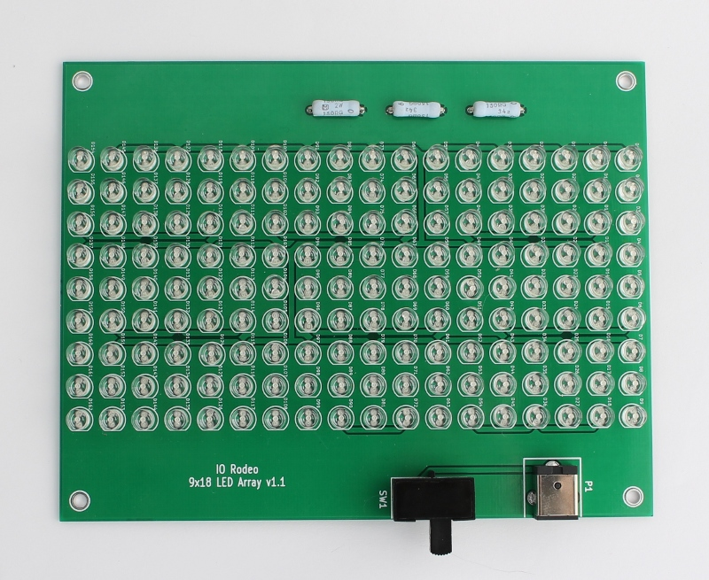

Assembly step 1 
==============================================================

.. figure:: all_pcbs.JPG
   :align:  center

Note that if you have a kit with a pre-assembled LED board you can skip this step in the assembly. 

Blue LED array board 
-----------------------

Solder all of the components onto the PCB. **Important note on soldering the LEDs:** Make sure to check the orientation of the LEDs before soldering. The cathode of the LED is indicated by the flat edge on the silkscreen of the PCB. Insert the LED so that the short leg (cathode) is nearest the flat edge in the silk screen. For an Instructable on soldering components onto circuit boards, check out `How-to-solder <http://www.instructables.com/id/How-to-solder/?ALLSTEPS>`_ (Steps 4& 5) by noahw.

**Resistors:** 

* Mini - one resistor into position R1 *or* R2; 
* Midi - three resistors in positions R1-R3; 
* Large - six resistors in positions R1-R6.  

**DC jack:** All versions - Insert into position P1.

**Switch:** All versions - Insert into position SW1.

Images of assembled boards
----------------------------

Mini version
^^^^^^^^^^^^^^^

.. figure:: mini_pcb.JPG
   :align:  center

Midi version
^^^^^^^^^^^^^^^

Large version
^^^^^^^^^^^^^^^^
.. figure:: large_pcb.JPG
   :align:  center

Testing the board
---------------------
Once all the components are in place, plug in the 12 V power supply and switch on the board to check all of the LEDs are working correctly.

.. figure:: image_9.jpg
   :align:  center

