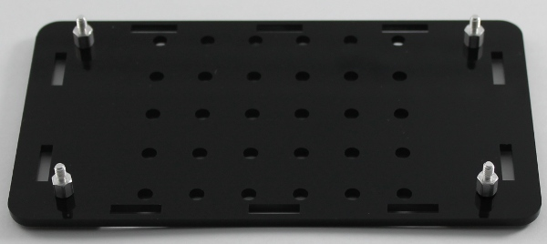
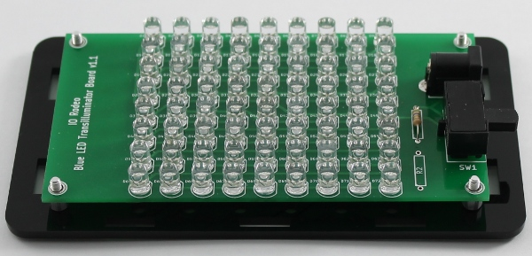
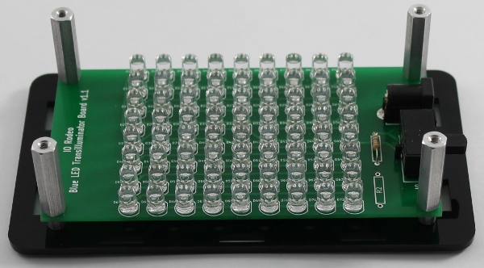
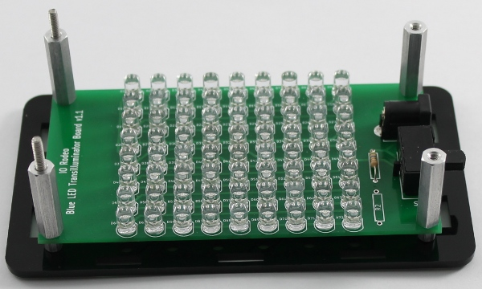

Assembly step 2
=================================

Enclosure base assembly
---------------------------

This set of instructions applies to all versions of the transilluminator. Images from the mini version are shown.
Before starting assembly, peel off any of the paper or plastic backing from the laser cut parts. 

Take the enclosure base and attach the four small male-female standoffs using the four 1/4" long screws
^^^^^^^^^^^^^^^^^^^^^^^^^^^^^^^^^^^^^^^^^^^^^^^^^^^^^^^^^^^^^^^^^^^^^^^^^^^^^^^^^^^^^^^^^^^^^^^^^^^^^^^^^^^

Place the PCB onto the 4 standoffs and screw in the four 1" long standoffs
^^^^^^^^^^^^^^^^^^^^^^^^^^^^^^^^^^^^^^^^^^^^^^^^^^^^^^^^^^^^^^^^^^^^^^^^^^^^^^^^^^^^^^^^^^^^^^^^^^^^^^^^^^^

Take the two threaded studs and screw them all the way into the two standoffs on the opposite side of the PCB to the DC Jack and switch. Check the image below for correct orientation.
^^^^^^^^^^^^^^^^^^^^^^^^^^^^^^^^^^^^^^^^^^^^^^^^^^^^^^^^^^^^^^^^^^^^^^^^^^^^^^^^^^^^^^^^^^^^^^^^^^^^^^^^^^^^^^^^^^^^^^^^^^^^^^^^^^^^^^^^^^^^^^^^^^^^^^^^^^^^^^^^^^^^^^^^^^^^^^^^^^^^^^^^^^^^^^^^^^^^^

